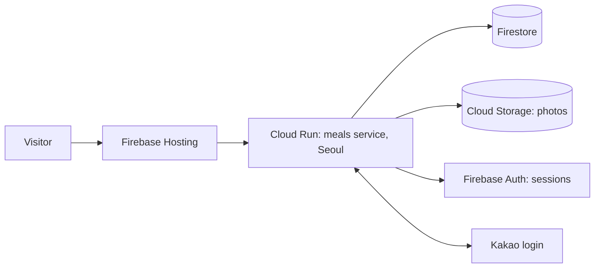

# Meals — church meal sign-up app (그 사랑교회 Meals)

[](https://github.com/ej-kim-dev/hisgreatlovechurch-meals/actions/workflows/ci.yml)

A phone-first web app where church members sign up for shared meals and order menus, and leaders manage restaurants, order sheets and payments. Built with Next.js and TypeScript on Google Cloud Run, with Firestore, Cloud Storage and Firebase Auth; members sign in with Kakao. In use at the church since late September 2026, with 30+ members signed in. The interface is in Korean.

**Live site:** https://hisgreatlovechurch-meals.web.app

## What it does

- **신청** — members choose a date and a restaurant, say how many people are coming, and order menus. They can edit or cancel until the cutoff (a signup that is already marked paid cannot be cancelled).
- **마이 페이지** — the member's own signup, order sheet and payment instructions (tap the account number to copy it). Meals paid by the church show 교회 지원 instead.
- **관리** (leaders and admins):
  - **현황** — signups per restaurant, by person or by menu, with an order sheet; tick 입금 when a transfer arrives; tap a signup to correct it.
  - **식사** — create meals (several per day are fine), choose restaurants, leader, bank account or 교회 지원, and show or hide individual menus for that meal.
  - **식당** — saved restaurants with photo, store link and menus. Menus are added, edited and removed here only.
  - **아카이브** — finished meals by date range and restaurant, with totals.
  - **권한** (admins) — assign leader/admin roles.
- Meals move to the archive 7 days after their date once every order is settled. Nothing is ever deleted.

## Local preview

Requires Node.js 22 or newer. The local preview uses sample people, restaurants and bank details; it does not touch the church database.

```bash
npm ci
cp .env.example .env.local
npm run dev
```

Open <http://localhost:3000>. The preview bar switches between 교인, 리더 and 관리자. Preview data resets when the dev server restarts. Demo mode is refused on Cloud Run and in production builds even if `APP_MODE=demo` is set by mistake.

```bash
npm run lint
npm run typecheck
npm test
npm run build
```

Tests use Node's built-in runner and cover authorization, cutoffs, validation, price snapshots, church-paid meals, payment rules and archiving.

## How it is hosted



See the [deployment guide](docs/deploy.md) for setup, redeploying and troubleshooting, and [requirements](docs/requirements.md) for the agreed behavior.

## Structure

- `app/page.tsx`, `app/components/` — the member and staff interface (Korean).
- `app/api/` — server endpoints: Kakao login, commands, state, archive, photo upload and download.
- `lib/domain.ts` — every change is a validated command with role checks; `lib/store.ts` — Firestore persistence and archiving.
- `lib/auth.ts` — Kakao → Firebase session flow (cookie `__session`, the only cookie Firebase Hosting forwards).
- `firestore.rules` — denies all direct browser access; only the server (Admin SDK) reads and writes.
- `firebase.json`, `hosting/` — Hosting configuration that forwards every request to Cloud Run.

## Design decisions

- **All data access goes through the server.** Firestore rules deny every direct browser read and write. Only Cloud Run touches the database, and every change is a validated command with role checks in `lib/domain.ts`, so permissions are enforced in one place.
- **Sessions use the `__session` cookie.** Firebase Hosting forwards only that cookie to Cloud Run, so the Kakao-to-Firebase login flow is built around it.
- **Minimal personal data.** Kakao login yields only an app-scoped user ID, with no email or phone number; the only personal data is the display name members type in.
- **Orders keep a price snapshot.** Editing a restaurant or menu never rewrites names and prices on orders already placed.
- **Nothing is deleted.** Settled meals move to an archive after 7 days.
- **Demo mode can't run in production.** It's refused on Cloud Run and in production builds.

## Security and privacy

Kakao's app-scoped user ID is linked to an internal account; email and phone number are never requested. Every change is checked on the server, so editing someone else's order or role is rejected. Browser writes must come from the site's own origin. Photos are served only to signed-in users. Restaurant and menu edits never rewrite names and prices on orders already placed. The first admin is set with one Kakao ID in the server configuration.
